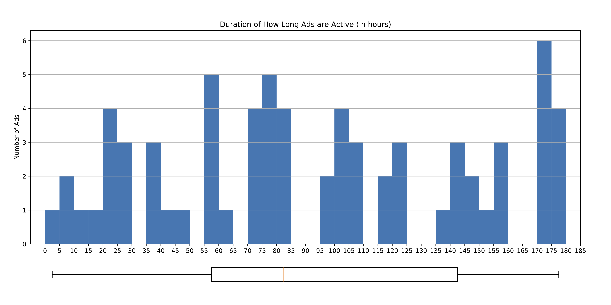

# Housing Market in Constance  
***  

## 1. About the Author   
**Created by:**  
 Marius M. Groen  

**For:**  
 Computational Social Sciences with Python  
 Supervised by: Dr. Nils Meise  
 Department of Sociology  
 University of Konstanz  

**On:**  
 In the Summer Term 2019  


## 2. About the Project  
The main goal of the presented tool is to create a file
that contains all the advertised shared flats that have been
published on one of the largest providers on the housing market.

In particular, the following tool automatically saves all offers presented
on <http://www.wg-gesucht.de> for a given city (*Constance, in this case*).
Collected data includes the room's size, price and price per square meter.
Furthermore, the address and the household composition (by number of people and gender)
of the shared flat are saved. Metadata for each ad include their unique ID as well as the
link to the source and the offer's title description.
Moreover, timestamps for activating as well as deactivating the ad are created, allowing
to estimate the duration of each ad being active.

This collection of data is achieved by several processes:

1. Setting up a webserver which automatically runs the necessary script regularly  
2. Creating an environment and data structure to work on  
3. Scraping the data  
4. Parsing the retrieved html-documents into a usable format and clean that  
5. Combining the new data with the earlier saved  

**Start of the _fully-automated_ collection was on July 23.**  


### 2.1 Webserver  
The script is saved and ran on a webserver. This guarantees an always available resource
that can run the script automatically and store the emerging results.  

Due to the simplicity and cost-free service, bwCloud is used. In this, a server is set up
which runs the latest stable Ubuntu.  
For the execution of the script, the installation of Python 3 was necessary, as well as the
installation of pip3. This is mandatory due to the used packages and extensions within the
script.  
The script is ran automatically every four hours, starting from 8.50am and ending at 8.50pm.
This is set as a crontab, which looks like follows:  
```shell
50 8,12,16,20 * * * /usr/bin/python3 /home/marius/python_project/project.py
```
It defines the number of minutes `50` and hours `8, 12, 16, 20` of the runtime, whereas the 
remaining spaces identify the days, months, and weekdays (`* * *` implying *all*).
Afterwards the path to the used python is given `/usr/bin/python3` which can be found
on the webserver using `which python3`. The last part of the crontab identifies the file that
should be run and refers to the script itself.  


### 2.2 Project Structure  
In order to have a fixed structure, in which the tool would run
and could be replicated in a better way, the script creates its own
environment of directories.  

As a consequence, nothing but the script itself is needed in order to
start the collection and cleaning of data.
The path to where the folders should be created is saved in the script
as a separate string-variable. This ensures, that the script could be 
exported to others systems with only minor change necessary.  

1. The directory `~/data/` is created.  
   It will contain three subdirectories and the most recent total dataframe.  
   
2. The subdirectory `~/data/html/` is created.  
   This will contain subdirectories for each process of scraping.  
   
3. The subdirectory `~/data/raw/` is created.  
   In this, the from html-format parsed data will be stored.  
   
4. The subdirectory `~/data/clean/` is created.  
   Here will the cleaned data from each parsing be saved.   
   
5. The subdirectory `~/data/html/today` is created.  
   In this, the part of the path `today` is not the actual name of the directory
   but is replaced with the current timestamp of each running of the script in the
   format of `YYYYMMDD-HHMM`. In each of these sub-subdirectories, the scraped html-
   files will be saved. These can serve as a backup since they are the only way to
   recreate data at a given point of time if something in the process of parsing fails.  

6. The file `0_total.csv` is saved at `~/data/`.  
   This file at each given time represents the dataset
   that contains the most recent information about all ever offered
   shared flats on the platform.  
   This is handled in greater detail in section `2.5 Appending`.  
   
7. The file `dataframes.txt` is created at `~/`.  
   This document is used as a log of all cleaned datasets created
   in the process of the script's running. Its usage and setup is
   explained in greater detail in section `2.4 Parsing and Cleaning`.  

The so created structure results in an environment of order and guarantees a
transparent and functional usage of the tool. For a better understanding,
the structure is exemplified by the following snapshot:
```shell
tree -L 5
```
  


### 2.3 Scraping  
Every time the script runs, the websites most recent 500 ads for shared
flats in Constance are saved locally. These are stored as *.html-files.
The number of saved results is defined in a separate variable for easier
changing (if wanted). It represents the number of pages one wants to store,
whereas each page consists of 20 results, all being sorted by recency.  


### 2.4 Parsing and Cleaning  
#### Parsing  
In order to get the scraped data into a human-readable and easier to
analyze format, parsing is necessary. In this, the most relevant
information is extracted from the \*.html-files and transformed into
a \*.csv file.  

In order to do so, an empty dataframe with the relevant columns is
set up. The necessary columns and their content will be explained below.
Using the `beautiful soup`-package, the html-container that contains
all actual offers of shared flats (and no promotions) is defined. Looping
over this allows to extract the following features for each ad:  

* Weblink  
* Online-ID  
* Size of household  
* Number of females in flat  
* Number of males in flat  
* Size of room  
* Price of room  
* Price per square meter  
* Multiple values on address:
    * Self-reported district  
    * Full address  
    * Name of street  
    * House number  
    * _Geopy_ Address  
    * _Geopy_ District  
    * _Geopy_ Latitude  
    * _Geopy_ Longitude
    * District _(placeholder)_  
* Title of the offer  
* Timestamp of scraping  
* Timestamp of inactivity  
* Boolean for being active  

`Geolocator geocode` was used to on the one hand correct spelling and
the self-reported district of the flat and on the other hand to backward
geocode the location, resulting in geocoordinates instead of the actual address.
This is necessary for plotting the results in later graphical analysis.  
Since active and inactive flats do not share the same structure, these
extractions are nested within an `if-else` construction.  

Each turn of the loop over containers results in the creation of a valuelist
that can be used to write a row to the dataframe for each ad.  


#### Cleaning  
Since some of the extracted information may not be correct (due to misspelled names
or an incorrect declaration of the district), further cleaning is necessary.  

For this, a hard-coded list of 18 legit districts is defined and used to filter
and alter the given information.
**Then all rows that contain no proper address are deleted.**  
This seems like a harsh decision but is made with regards to the goal of the analysis;
shared flats without any proper address cannot be used in this in any way that was
firstly thought of. Since this only affects very few observations (until now less
than 5%), this is acceptable.  
Afterwards the datatype of the columns are set according to the columns content.  
To finalize the process of data-creation and -manipulation, the columns are reordered
and the dataframe is returned and saved as an \*.csv-file.  

After exporting the data, the filename of each cleaned dataset is linewise written 
(appended) to `dataframes.txt`. This textfile therefore serves as a log-file as well
as a list of all parsed datasets. This can be used to combine all parsed datasets to a
masterfile containing the total amount of data; as presented in the next step.  


### 2.5 Appending  
In every execution of the script, the most recent cleaned dataframe
is appended to the prior existing *'total'* dataframe
(`0_total.csv`).  

This is guaranteed by using the automatically created log-file of
all cleaned datasets (`dataframes.txt`). The last line of the file
is set to be the name of the most recent cleaned dataset.  
While appending, previously observed ads are checked for change
in their activity status. If there are no changes, the duplicates
are dropped. If a formerly active ad has been turned off in
the time between running the script, a new timestamp for inactivity
is given to that ad and the boolean activity status is set to false.
Since some people seem to turn their offer off and on again in order
to appear on top of the list again (due to the website showing all
offers ordered by recency of being online), the mechanism is implemented
vice versa, too. This means that an inactive offer, that has been added
with new data as active, is turned to active again and the timestamp of
inactive is reset to `None`.  

Afterwards, the updated total dataframe overwrites the old one, leading
to `0_total.csv` at any given time representing the dataset that contains
the most recent information about all ever offered shared flats.  

Since the `0_total.csv` file does not exist by default, it is created
as a copy of the first cleaned dataframe when executing the script
for the first time. This is done with `shutil`.
Therefore, in every further runtime, the total file
exists and satisfies the given requirements as stated above.  


### 2.6 Analysis  
Even though not part of the process of data generation and manipulation, analysis
is (or *should be*) the eventual goal of each project in social science.
Since this tool focusses more on a proof of concept, multivariate analysis
and complex methods are not provided.  
Nevertheless, descriptive statistics and tabulations as well as good visualizations
allow for a deep dive into the housing market of Constance and provide fist insights
into what is possible with computational approaches like the ones presented in here.  

Analysis is not part of the initial script but instead performed in a separate
notebook in which the most crucial features of the housing market are examined:  

- Descriptive statistics of the data itself  
- Summary of timespan in that ads are active before being turned off  
- Distribution of room size in general and by district  
- Distribution of room price by district  
- More comparable distribution of room price per square meter by district  
- Detailed visualization of geographical distribution of ads  
- More generalized visualization of the geographical distribution  


## 3. Examples of Results  
### 3.1 Data
The scraped and cleaned data does have a structure like the following:  
  

### 3.2 Quantitative Analysis
#### Duration  
Analyzing how long each ad is active before being turned off,
the following results emerge:  
  

As can be seen from the graph, 50% of the ads are active
between 55-145 hours (~ 2-6 days). Nevertheless, some are
closed after less than 24 hours while others have been online
for a whole week. This shows, how big the range and variation is,
leading to further questions which are discussed in greater detail
in chapter `4.1 Potential of Data`.


#### Total Price  
Analyzing the price (in Euro) by district, the results can be summarized with
the following boxplots, showing the span as well as the median price for each location:  

  
Whereas the y-axis displays the price of each ad, sorted by district on
the x-axis.  
  
  
#### Relative Price  
In order to make the prices more comparable, they are calculated to be the estimation
of Euro per square meter in size. Analyzing this by district, the results can again 
be summarized with the following boxplots:  

  
Whereas the y-axis displays the price per square meter of each ad, sorted by
district on the x-axis.  
  
  
#### Size  
Analyzing the size (in square meter) by district, the results can be summarized with
the following boxplots, showing the span as well as the median price for each location:  

  
Whereas the y-axis displays the size of each room, sorted by
district on the x-axis.  
  
  
### 3.3 Data Visualization
In order to get a visual overview of the distribution of rooms,
maps can be used. This allows for a fast and comprehensive understanding
of the geographical distribution and therefore leads to an intuitive
cognition of 'hotspots' in Constance. As examples, two visualizations
are presented, even though various other types would be possible:  

#### MarkerMap  
Plotting every active ad as a blue circle and mapping it with a popup,
containing information such as the ads ID as well as the price and size
of the room, can be seen as a first step in visual exploratory data analysis.  

  


#### HeatMap    
A heatmap contains more generalized data and could therefore be very much 
suitable for publication. Without showing the concrete address of every each
ad, it cummulates to the distribution without losing its key feature, that is
providing an easy to understand visualization of the flat's geographical distribution.

  


## 4. Outlook  
In this section a short overview is given about what future work in this
tool and analysis could contain. It does not only highlight chances and further
the potential of the given approach but also does point out the opportunities
of improvement.  

### 4.1 Potential of Data  
Raising the question: *"What further could be done with the created data?"* leads
to identifying the potential use-cases for scientific research:  

- How do the prices on the housing market change over time?  
    - Construction of an empirical rental price index  
- Which factors influence the price of a room?  
    - ...are features of the flat relevant? \*  
    - ...are distances to certain points of interest relevant?  
    - ...is the composition of the household relevant?  
- Which factors influence the duration of activity of ads? \*  
- How strong does the market change due to season?  
    - i.e. the start and end of semesters at the HTWG/University  
- How do certain districts change over time?  
- Which influence do newly created housings have?  
    - i.e. *Konstanz Hafner*; how does the market develop in there?  
    - How do prices and supply change in other districts due to new space?  
    - Do the "hotspots" for living in Constance change over time?  

_\* Can only be answered with additional data; this needed data is all potentially
available by expanding the scraping-process._  


### 4.2 Potential of Methods  
Points of emphasis, in which the method should be further improved:  

- Decoding of addresses  
    - espacially swiss addresses are badly coded  
      *(I tried to handle this when manually adding* `haupstrasse` *as a filter*
        *for swiss addreses, but this is bad practice and should urgently be improved)*
- Space-saving processing  
    - In order to reduce hoarding of data, it would be advisable to delete old html-
      directories and files. These are the most memory intense data but serve as
      a potential source of backup in case of failure.  
      One could implement a reservoir of e.g. 12 html-folders (data of three
      days) and delete the oldest directory each time a new one is created.
      In this, space usage would be constant and backups would still be possible for
      a given period of time.  
- Clustering of markers  
    - Since a lot of ads are proposed to the same addres, the markers
      should be clustered if the coordinates are exactly equal in the
      marker-map. Otherwise one cannot access all the datapoints in the interactive map.  
      Heatmap does not have that as a problem.  
- Dynamic maps featuring timeline  
    - For visualizing the evolution of hotspots over time it would be necessary
      to include a timeline to the maps and therefore create either an animation
      or a new tile for each point in time one wants to view.  


***
